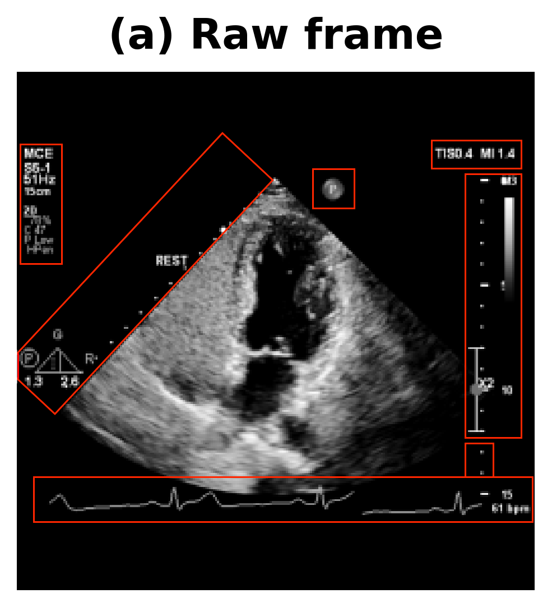
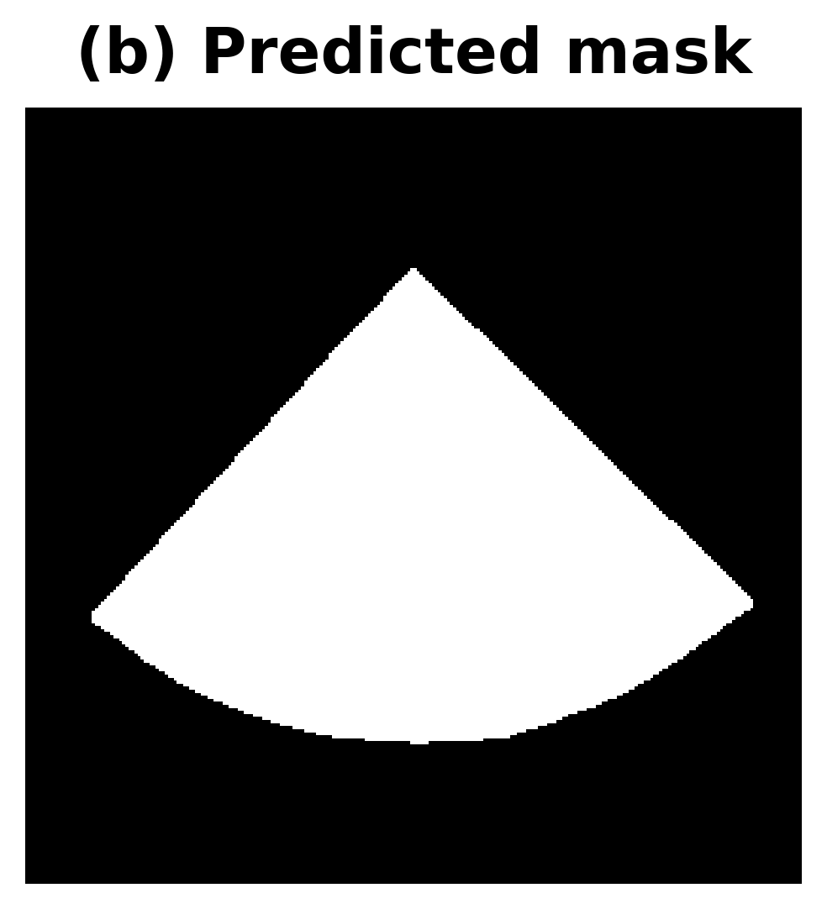
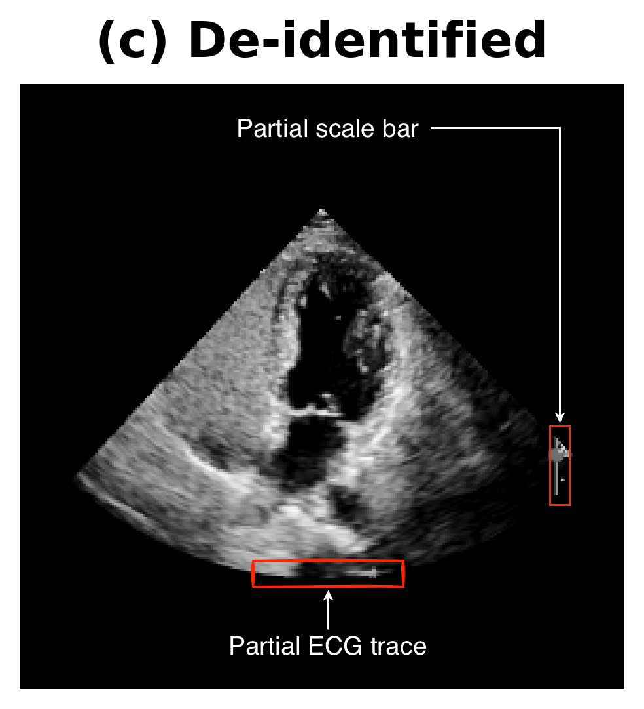
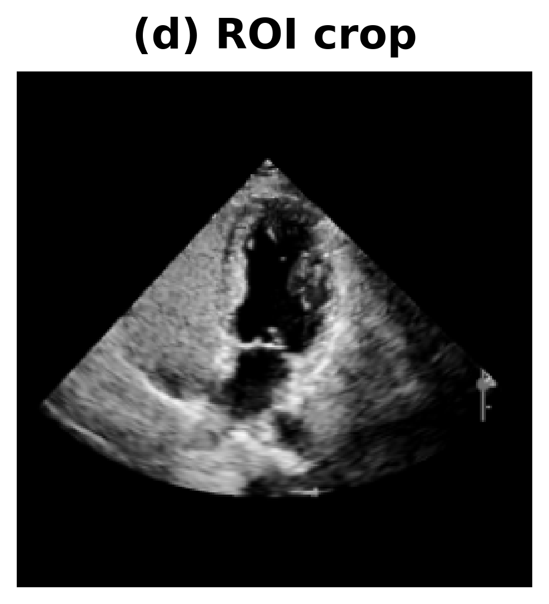

# EchoROI

**A U-Net-based tool for echocardiographic ROI segmentation and anonymisation.**

[](https://pypi.org/project/echoroi/)
[](LICENSE)
[](https://www.python.org/)
[](https://www.tensorflow.org/)
[](https://onnxruntime.ai/)
[](https://github.com/Kamlin-MD/UNET-Echocardiography-ROI-segmentation/actions/workflows/ci.yml)

---

## Example Output

<p align="center">
  
  
  
  
</p>

**(a)** Raw frame with burned-in overlays — **(b)** predicted scan-sector mask — **(c)** de-identified output — **(d)** ROI crop.

---

## Overview

EchoROI segments the fan-shaped ultrasound scan sector in echocardiography frames and masks everything outside it — scanner chrome, ECG traces, measurement overlays, text, and vendor graphics. The result is a clean, standardised image suitable for:

- **Anonymisation** — removing protected health information (PHI) burned into pixel data.
- **Preprocessing for machine learning** — delivering only clinically relevant pixels to downstream models.
- **Standardised cropping** — producing consistent inputs from heterogeneous multi-site, multi-vendor datasets.

The pretrained model (U-Net, ~31 M parameters) was trained on 1,355 annotated echocardiographic frames spanning four-chamber, parasternal, and subcostal views across eight datasets, achieving a Dice coefficient of **0.9884** on the held-out validation split.

---

## Key Features

- **Scan-sector segmentation** — binary mask prediction for the ultrasound field of view.
- **De-identification** — zero out all non-ROI pixels in a single step with `--deidentify`.
- **ROI cropping** — extract and resize the scan sector for downstream pipelines.
- **Keras + ONNX** — pretrained weights in both formats; ONNX enables inference without TensorFlow.
- **CLI and Python API** — scriptable workflows for prediction, training, evaluation, and benchmarking.
- **DICOM preprocessing pipeline** — batch-process DICOM datasets via the included notebook.

---

## Installation

### From PyPI

```bash
pip install echoroi
```

> **Note:** The PyPI package installs the `echoroi` library and CLI but does
> not include model weights (they exceed PyPI size limits). Download the
> pretrained Keras and/or ONNX weights from the
> [GitHub repository `models/` directory](https://github.com/Kamlin-MD/UNET-Echocardiography-ROI-segmentation/tree/main/models)
> or clone the repository (see below).

### From source (for development)

```bash
git clone https://github.com/Kamlin-MD/UNET-Echocardiography-ROI-segmentation.git
cd UNET-Echocardiography-ROI-segmentation
pip install -e ".[dev]"
```

---

## Quickstart

### CLI — predict and de-identify

```bash
# Predict masks for a directory of frames
echoroi predict \
  --model-path models/echoroi_unified.keras \
  --input path/to/frames/ \
  --output results/

# Predict + de-identify in one step
echoroi predict \
  --model-path models/echoroi_unified.keras \
  --input path/to/frames/ \
  --output results/ \
  --deidentify
```

### Python API

```python
from echoroi import UNetPredictor

predictor = UNetPredictor("models/echoroi_unified.keras")
mask = predictor.predict_single_image("path/to/frame.png")  # (256, 256, 1) array
```

### ONNX inference (no TensorFlow)

```python
import onnxruntime as ort
import numpy as np

sess = ort.InferenceSession("models/echoroi_unified.onnx")
# image: (1, 256, 256, 1) float32, normalised to [0, 1]
mask = sess.run(None, {"input": image})[0]
```

---

## Example Workflow

```
Input frames (PNG / DICOM)
  → Resize to 256×256 (aspect-ratio preserving, zero-padded)
  → U-Net mask prediction (scan sector vs. background)
  → Apply mask: zero out non-ROI pixels (de-identification)
  → Crop to scan-sector bounding box → resize to target dimensions
  → Save cleaned frames / compressed NPZ
```

The [DICOM preprocessing notebook](notebooks/04_dataset_preprocessing.ipynb) implements this end-to-end with adaptive stride, representative-frame selection (Shannon entropy), and batch processing.

---

## Repository Structure

```
EchoROI/
├── echoroi/              # Python package
│   ├── model.py          #   U-Net architecture & loss functions
│   ├── preprocessing.py  #   Image preprocessing utilities
│   ├── inference.py      #   Prediction helpers
│   ├── training.py       #   Training pipeline
│   └── cli.py            #   Command-line interface
├── models/
│   ├── echoroi_unified.keras   # Pretrained Keras weights (373 MB)
│   └── echoroi_unified.onnx    # ONNX export (124 MB)
├── notebooks/
│   ├── 01_training_and_evaluation.ipynb
│   ├── 02_onnx_conversion.ipynb
│   ├── 03_inference_demo.ipynb
│   └── 04_dataset_preprocessing.ipynb
├── data/                 # Training images & masks (1,355 pairs)
├── paper/                # Manuscript (under development)
├── tests/                # Unit tests (23 tests)
├── scripts/              # Conversion & utility scripts
├── MODEL_CARD.md         # Model card with intended use & limitations
└── CITATION.cff          # Citation metadata
```

---

## Notebooks

| # | Notebook | Description |
|---|----------|-------------|
| 01 | [Training & Evaluation](notebooks/01_training_and_evaluation.ipynb) | End-to-end training, augmentation, evaluation |
| 02 | [ONNX Conversion](notebooks/02_onnx_conversion.ipynb) | Export, validation, Keras-vs-ONNX comparison |
| 03 | [Inference Demo](notebooks/03_inference_demo.ipynb) | Inference, visualisation, ROI extraction |
| 04 | [Dataset Preprocessing](notebooks/04_dataset_preprocessing.ipynb) | DICOM → NPZ pipeline using ONNX model |

---

## Testing

```bash
pytest tests/ -v
```

### Note for macOS (Apple Silicon) users

The `tensorflow-metal` GPU plugin can deadlock inside Jupyter kernels on
some Apple Silicon configurations. The inference notebook
(`03_inference_demo.ipynb`) disables GPU devices automatically so that all
operations run on the CPU. This has no practical impact — inference on
256 × 256 images takes less than 1 second per frame on CPU.

---

## Citation

If you use EchoROI in your work, please cite the software repository and the version you used:

```bibtex
@software{ekambaram2026echoroi,
  author    = {Ekambaram, Kamlin and Arnab, Anurag and Herbst, Philip and
               Theart, Rensu},
  title     = {{EchoROI}: Scan-sector Segmentation and De-identification
               for Echocardiography},
  version   = {0.1.0},
  url       = {https://github.com/Kamlin-MD/UNET-Echocardiography-ROI-segmentation},
  year      = {2026}
}
```

See [`CITATION.cff`](CITATION.cff) for machine-readable citation metadata.

---

## Manuscript

A manuscript describing EchoROI is included in this repository and is under active development. See [`paper/paper.md`](paper/paper.md) for details.

---

## Disclaimer

EchoROI is intended for **research and educational use only**. It is not a clinical diagnostic device, is not approved for clinical decision-making, and should not be used as such. De-identification via scan-sector masking reduces but does not guarantee complete removal of protected health information — human review and institutional governance procedures remain necessary before external data sharing.

---

## License

MIT — see [LICENSE](LICENSE).
