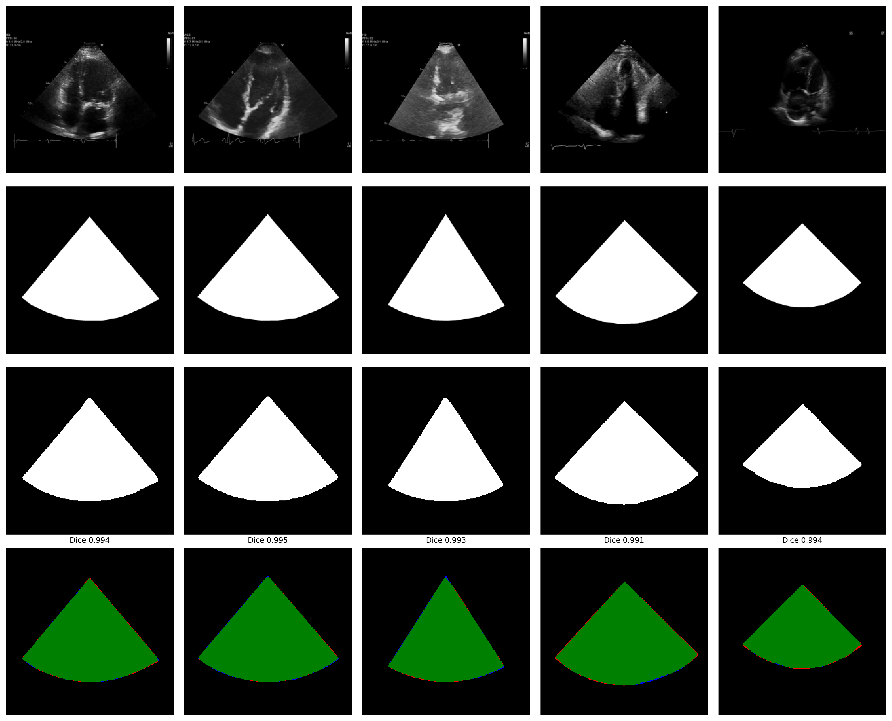

# Summary

Echocardiography is the most widely performed cardiac imaging modality, yet
large-scale computational analysis of echocardiogram videos is hindered by
protected health information (PHI) and vendor-specific overlays that are frequently
burned into the pixel data [@madani2018fast-088]. `EchoROI` is an open-source Python package that uses
a U-Net convolutional neural network [@ronneberger2015unet] to segment the
fan-shaped ultrasound scan sector---the region of interest (ROI)---in each
frame, and to mask out non-ROI content (e.g., identifiers, ECG traces, calipers,
measurement readouts, and vendor logos). The resulting frames preserve the
native scan-sector resolution while removing distracting background elements,
facilitating dataset preprocessing for machine learning and enabling safer
sharing of examples for teaching.

EchoROI is distributed as an installable Python package with both a command-line
interface (CLI) and a Python API. Users can apply the pretrained model, fine-
tune it on site-specific annotations, and export models to ONNX for deployment
outside TensorFlow.


# Statement of Need

Many echocardiography files contain PHI and vendor overlays rendered directly
into pixel data, restricting data sharing and introduces confounders for
computer-vision models [@panhuis2014systematic-d31]. Public datasets such as MIMIC-IV-ECHO [@gow2023mimic]
contain identifiers and overlays that must be removed to support privacy-
preserving research workflows; manual anonymisation is impractical for modern-
scale collections.

Existing tools address related subproblems. OCR-based pipelines can remove textual overlays but may fail when display layouts vary across vendors or when overlays appear in low-contrast regions [@monteiro2017deid]. Heuristic ROI detection approaches work well for fixed imaging layouts but may not generalise across vendors, zoom levels, or probe orientations [@kline2023pylogik].

Public datasets such as EchoNet-Dynamic distribute pre-cropped videos [@ouyang2020echonet], simplifying modelling but discarding the original pixel geometry and assuming stable display conventions. These heuristics were tuned for specific acquisition settings and may leave residual overlays or remove non-ventricular anatomy relevant for downstream tasks.

`EchoROI` provides an end-to-end, open-source workflow for learning the true
scan-sector boundary with deep segmentation and using that boundary to standardise
frames for downstream analysis. By explicitly modelling the curved sector edges,
EchoROI avoids fragile cropping heuristics, supporting diverse acquisition
layouts. Including frames from both EchoNet-Dynamic and EchoNet-Paediatric in
the training set (alongside six other heterogeneous sources) ensures the learned
mask captures the full scan sector regardless of fan angle, depth, or vendor, and
removes distracting overlay elements that heuristic methods miss.
Standardising the field of view also reduces wasted model capacity on
static overlays, which is particularly relevant for representation-learning
approaches such as masked autoencoders [@he2022mae; @video_mae_2022].

Recent benchmarking work has shown that heterogeneous preprocessing and residual
overlays can induce shortcut learning in echocardiography foundation models,
harming cross-dataset generalisation [@taratynova2025cardiobench]. By providing
consistent sector masking across vendors and acquisition settings, EchoROI can
help stabilise benchmarks and mitigate acquisition-artifact confounds. Emerging
multimodal pipelines that integrate cardiac imaging with transcriptomic and
clinical data similarly depend on clean, standardised imaging inputs
[@le2026imagingomics], further motivating robust automated preprocessing.

# Usage

EchoROI can be used from the command line for batch preprocessing or as a Python
library within research pipelines.

For typical echocardiography acquisitions, the scan sector (ROI) is static over
the duration of a cine loop: it is determined by probe geometry (most commonly a
phased-array sector), the selected field of view (fan angle/depth), and
user-controlled placement/orientation. EchoROI exploits this by predicting a
mask on a single representative frame and then applying the same mask (and the
resulting crop window) to all frames in the sequence.

By default, the representative frame is selected automatically as the
highest-entropy frame among the first few frames (to avoid blank/transition
frames). Users can alternatively specify the representative frame index. This
design reduces compute cost for large datasets while enforcing consistent
preprocessing within each clip.

```bash
# De-identify: black out everything outside the scan sector
echoroi predict \
  --model-path models/echoroi_unified.keras \
  --input video_frames/ \
  --output clean/ \
  --deidentify

# Fine-tune on site-specific annotations
echoroi train \
  --image-dir data/images \
  --mask-dir data/masks \
  --model-path models/echoroi_finetuned.keras \
  --epochs 50 \
  --batch-size 8 \
  --learning-rate 1e-4 \
  --results-dir training_results
```

```python
from echoroi import UNetPredictor

predictor = UNetPredictor("models/echoroi_unified.keras")
mask = predictor.predict_single_image("frame.png")
result = predictor.process_image_with_visualization(
    "frame.png", save_path="output.png"
)
```

# Implementation

## Architecture

EchoROI uses a standard U-Net [@ronneberger2015unet] with four encoder and four
decoder blocks (31 million parameters). Encoder blocks apply 3x3 convolutions
with ReLU activation, He-normal initialisation, and spatial
dropout (0.1--0.3), followed by 2x2 max-pooling. The decoder mirrors this
structure using transposed convolutions and skip connections. A final 1x1
convolution with sigmoid activation produces a single-channel binary mask. Input
and output are 256x256x1 grayscale images.

Training uses binary cross-entropy loss and is monitored with Dice and
intersection-over-union (IoU). Optimisation uses Adam with an initial learning
rate of $1 \times 10^{-4}$ and a reduce-on-plateau schedule (factor 0.5,
patience 5 epochs). The reference implementation is built in TensorFlow/Keras
and was trained and evaluated on an Apple Mac mini with an M2 Pro (CPU/GPU).


## Training Data

The model was trained on 1,355 manually annotated echocardiogram
frame/mask pairs drawn from multiple sources:

| Dataset                     | Frames | Access       |
|:----------------------------|-------:|:-------------|
| MIMIC-IV-ECHO               |    403 | PhysioNet    |
| EchoNet-Dynamic             |    145 | Stanford     |
| EchoNet-Paediatric          |    263 | Stanford     |
| CACTUS (A4C subset)         |     38 | Open access  |
| EchoCP                      |     60 | Kaggle       |
| Private dataset (consented) |     50 | Institutional|
| CardiacUDC                  |    247 | Kaggle       |
| HMC-QU                      |    149 | By request   |
| **Total**                   | **1,355** |           |

Sources: MIMIC-IV-ECHO [@gow2023mimic; @goldberger2000physionet], EchoNet-Dynamic
[@ouyang2020echonet], EchoNet-Paediatric [@reddy2022echonetpeds], CACTUS
[@elmekki2025cactus], EchoCP [@wang2021echocp], CardiacUDC [@yang2023graphecho],
HMC-QU [@degerli2024hmcqu]. The private dataset comprises consented samples from
Mindray and Samsung devices.

Ground-truth masks were created in LabelMe [@russell2008labelme-d8b] by outlining the scan-sector
boundary. For consistency, sector ROIs were annotated as polygons with a
virtual apex (triangular sector) even for some curved-probe images where the
true near-field boundary is an arc. Linear-probe (rectangular) ultrasound
layouts were not included in training.

Annotations included all visible diagnostic content while excluding padding,
borders, and overlay graphics. Only one frame per input video sequence was
included for training.

Training used a single 80/20 train--validation split created once at training
start by randomly shuffling the full dataset with a fixed seed. The split was
not stratified by dataset source. Batch size was 16 and training ran for 50
epochs.

## Software Design

EchoROI is distributed as a pip-installable package (`echoroi`) with modular
components for preprocessing, model definition, training, and inference. The CLI
provides subcommands for training, prediction, evaluation, and benchmarking.
Models can also be exported to ONNX for framework-agnostic deployment.

# Validation

On the validation split (20% of the 1,355 annotated frames), EchoROI achieves:

| Metric            | Value  |
|:------------------|-------:|
| Dice coefficient  | 0.9880 |
| IoU (Jaccard)     | 0.9763 |
| Pixel accuracy    | 0.9906 |
| Sensitivity       | 0.9894 |
| Specificity       | 0.9914 |

These segmentation results meet or exceed prior open approaches. PyLogik
reported 0.976 Dice on 50 images using heuristic morphological operations
[@kline2023pylogik]; fixed sector-template methods can achieve comparable
accuracy on single-vendor data but degrade when fan angle, depth, or display
layout varies across vendors. EchoROI's learned segmentation generalises across
the eight heterogeneous sources in the training set without vendor-specific
tuning. No separate held-out test set was used; the final metrics are reported
on the same validation split used for model selection (best checkpoint by
`val_dice_coefficient`), and may modestly overestimate generalisation
performance.

De-identification quality was assessed by manual spot-checking of model outputs
on the validation split. During LabelMe annotation, frames were also reviewed to
ensure that PHI was not present within the scan-sector ground-truth masks used
for training.

On a consumer Apple M2 Pro (CPU/GPU), inference takes approximately 25 ms per
256x256 frame, enabling real-time preprocessing of short echo clips.



# Limitations

EchoROI should be treated as a preprocessing and de-identification *aid* rather
than a guarantee of complete PHI removal. Masking may fail for atypical layouts,
low contrast, extreme zoom, handheld/POCUS devices, or when identifiers overlap
or traverse the scan sector.

EchoROI is designed primarily for sector-shaped echocardiography views (most
commonly phased-array probes). Curved-probe acquisitions may be approximated by
a virtual-apex (triangular) sector mask, which can introduce boundary error near
the probe face. Linear-probe (rectangular) ultrasound layouts were not included
in training and are not expected to perform reliably.

Because PHI can appear inside the ROI, users should apply human-in-the-loop
review and follow local governance procedures before external sharing of derived
images or cine loops.

To support responsible use, the repository includes a model card documenting
intended use, dataset composition, known failure modes, and performance
limitations. Users are encouraged to inspect low-confidence masks (e.g., peak
prediction probability below 0.5), atypical aspect ratios, or predicted ROIs
with implausible geometry as indicators of potential masking failures.

# Reproducibility

A minimal reproduction of the reported segmentation metrics can be performed
using the built-in evaluation command on a directory of images and masks:

```bash
echoroi evaluate \
  --model-path models/echoroi_unified.keras \
  --image-dir <IMAGE_DIR> \
  --mask-dir <MASK_DIR> \
  --output <EVAL_DIR>
```

For end-to-end dataset preprocessing, the repository includes a worked example
notebook (`04_dataset_preprocessing.ipynb`) demonstrating a DICOM-to-NPZ
workflow using the exported ONNX model:

1. Recursively discover DICOM files and load cine frames.
2. Optionally normalise clip length to a fixed frame count (e.g., 32) using an
   adaptive stride: evenly downsample when frames > target, or linearly
   interpolate when frames < target.
3. Resize to 256x256 with aspect-ratio preservation and zero-padding; convert to
   float32 and normalise pixel intensities to [0, 1].
4. Apply optional orientation transforms (horizontal/vertical flips and 90-degree
   rotations) for dataset-specific DICOM compatibility.
5. Select a representative frame automatically (highest Shannon entropy among the
   first few frames) and run ONNX EchoROI inference to obtain an ROI mask.
6. Broadcast the ROI mask across the full clip and compute an LV-focused square
   crop from the representative-frame mask (threshold 0.5; square side length set
   by the mask height and centred on the mask bounding box).
7. Apply the crop to all frames, resize to 112x112, and save as compressed NPZ
   arrays shaped (32, 112, 112).

Training data are not redistributed; users can retrain by providing matched
image/mask pairs derived from their permitted datasets and/or site-specific
LabelMe annotations.

# Availability and Reuse

EchoROI is released under the MIT licence. Source code, pretrained weights,
example notebooks, and a test suite are available at
[https://github.com/Kamlin-MD/UNET-Echocardiography-ROI-segmentation](https://github.com/Kamlin-MD/UNET-Echocardiography-ROI-segmentation).

The primary use case is research preprocessing of large echocardiography
collections: standardising frames by removing non-diagnostic background content
while preserving scan-sector resolution. A secondary use case is education
(e.g., sharing de-identified stills or cine loops for teaching and FOAMed),
subject to user responsibility and local policy.

Users working with devices or layouts not represented in the training set can
fine-tune the model on 50--100 annotated frames using the CLI or Python API.
EchoROI is not a substitute for institutional de-identification procedures;
governance review and human-in-the-loop workflows are recommended before any
external data sharing.

# Acknowledgements

This work was supported by the University of Stellenbosch Institute of Biomedical
Engineering. We gratefully acknowledge the following dataset providers whose data
made the training of EchoROI possible: the PhysioNet team and Beth Israel
Deaconess Medical Center for MIMIC-IV-ECHO [@gow2023mimic;
@goldberger2000physionet]; the Stanford Artificial Intelligence in Medicine and
Imaging (AIMI) Center for EchoNet-Dynamic [@ouyang2020echonet] and
EchoNet-Paediatric [@reddy2022echonetpeds]; the authors of the CACTUS dataset
[@elmekki2025cactus]; the EchoCP contributors [@wang2021echocp]; the
CardiacUDC team [@yang2023graphecho]; and the HMC-QU research group
[@degerli2024hmcqu]. EchoROI is built on TensorFlow/Keras, OpenCV, and the
Python scientific computing ecosystem.

# References